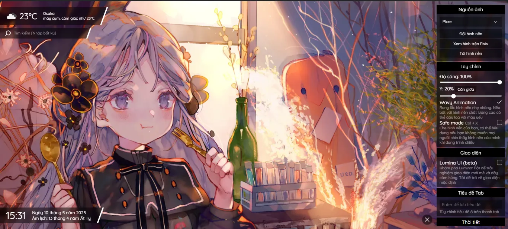
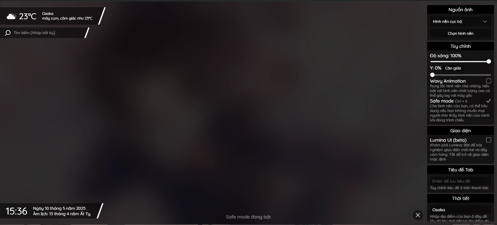

# Wibi New Tab

Wibi là một extension Chrome tùy chỉnh tab mới.
Dự án cá nhân, viết hoàn toàn bằng HTML, CSS, JavaScript thuần.
Tập trung vào visual, hiệu ứng nhẹ nhàng, đơn giản và dễ dùng.

## Tính năng

- Những tính năng trông sẽ rất chill nếu đề cùng với nền Anime=))
- Tùy biến cao, theme lấy cảm hứng từ UI của Phigros
- Giao diện đơn giản, chỉ có hình nền của bạn nổi bật
- Dành cho những ai muốn tab mới thật "nghệ" và chill
- Tập trung tối ưu hiệu năng và trải nghiệm người dùng
- Lịch âm
- Weather forecast

## Screenshot / Demo

https://github.com/user-attachments/assets/d89850e5-dfe1-453e-b3ae-717eda63642e

## Usage

1. Tải file `.zip` của dự án
2. Giải nén ra một thư mục
3. Mở Chrome và truy cập `chrome://extensions`
4. Bật "Chế độ dành cho nhà phát triển" (Developer mode)
5. Nhấn "Tải tiện ích đã giải nén"
6. Chọn thư mục vừa giải nén
7. Mở tab mới và tận hưởng

## Khác

- Project không sử dụng bất kỳ framework nào
- Project này chỉ dành cho mục đích cá nhân, không dành cho mục đích thương mại
- Email: nathanelytra2k7@gmail.com
